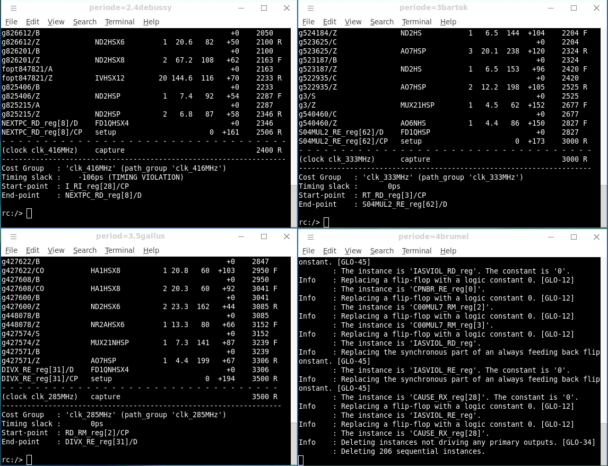

---
bibliography:
- 'biblio.bib'
---

University Pierre et Marie
Curie\
project MOCCA\

------------------------------------------------------------------------

\
[ **Report MOCCA : Synthesys, place and route of a given MIPS
architecture with CADENCE toolchain**]{}\

------------------------------------------------------------------------

\

*Authors:*\
Youcef Sekouri, William
Fabre

 

*Teachers :*\
Mr Matthieu Tuna,Pirouz Bazarghan-Sabet

\
[Year 2019-2020]{}\

Project script RTL compiler
===========================

This is our script, it has been inspired by this source[^1]

RTL Compiler
============

Load the libraries
------------------

Definition Liberty Timing File (LIB) : The .lib file is an `ASCII`
format file that represents timing and power parameters associated with
cells in a particular semiconductor technology. They are gathered by
simulating the cells under various conditions. It can have multiple
information[^2] :

-   operating conditions such as temperature and voltage.

-   fanout, capacitance, slew and all necessary thresholds.

-   Lookup table for timing arcs, those are functions of output load
    capacitance and input slew.

-   Area of the cell.

### Explain the difference between these two different types. {#explain-the-difference-between-these-two-different-types. .unnumbered}

-   The Library MAX (worst case) is used to verify the stability of the
    signal before the edge, also called setup time violation.

-   The Library MIN (best case) is used to verify the stability of the
    signal after the edge, also called hold time violation.

### Which one is needed for the synthesis step ? Explain your choice. {#which-one-is-needed-for-the-synthesis-step-explain-your-choice. .unnumbered}

During synthesis stage we only have a bunch of cells without any routing
delays between them. However, we still have for each cells, timing
aspects:

-   Rise Delay (Cell Rise): Propagation delay between output and input
    when output changes from 0 to 1.

-   Fall Delay (Cell Fall): Propagation delay between output and input
    when output changes from 1 to 0.

-   The threshold points from which 0 goes to 1 or 1 goes to 0 for the
    input and for the output.

-   Rise Slew (Rise Transition):

    -   lower slew threshold: Threshold from which it is considered to
        go to 1.

    -   upper slew threshold: Threshold from which it is considered to
        be 1.

-   Fall Slew (Fall Transition):

    -   upper slew threshold: Threshold from which it is considered to
        go to 0.

    -   lower slew threshold: Threshold from which it is considered to
        be 0.

{width=".65\linewidth"}

{width="0.65\linewidth"}

Therefore, we can use the WC library during the synthesis phase to check
if we meet the setup requirements. The sum of delays of a long path of
gates can create a setup time violation. The hold time violation is a
shortest path problem on the clock tree, here we don’t have any clock
tree. Furthermore, we can use statistical models (Wire Load Model) which
will allow us to do a more coherent timing analysis during synthesis.

### Pick up a timing arc in the WC lib and the same timing arc in the BC, what is the value in the first library and in the second library. Add in your report a figure of the cell and the corresponding timing arc. {#pick-up-a-timing-arc-in-the-wc-lib-and-the-same-timing-arc-in-the-bc-what-is-the-value-in-the-first-library-and-in-the-second-library.-add-in-your-report-a-figure-of-the-cell-and-the-corresponding-timing-arc. .unnumbered}

Here are some interesting differences between WC lib and BC lib to know
before we watch the graphics. Values for Temperature and Voltage:

[lllll]{} & & & &\
& & & &\
& & & &\

{width=".57\linewidth"}

{width="0.57\linewidth"}

Elaborate
---------

### The “elaborate” step does not synthesize the design, we will synthesize the design later on. What is the difference between elaboration and synthesis ? {#the-elaborate-step-does-not-synthesize-the-design-we-will-synthesize-the-design-later-on.-what-is-the-difference-between-elaboration-and-synthesis .unnumbered}

From this link there is a clear definition of elaboration a design[^3].

Synthesis might be seen as one big step for a user perspective. It
consists of :

-   Elaborating the design.

-   Apply constraints to the design.

-   High level optimizations of the design.

-   technology mapping (mapping with the library).

-   Low level optimizations of the design.

The Elaborate step consists is reading RTL file to recognize hardware
structures and transform them into future placeholders for the
technology mapping.

It seems that for some tools, the elaborate step also do some syntax
checks and verify the connections between structure. For example if two
outputs are connected etc.

This step is crucial because you cannot apply constraints on an RTL
file, so those placeholders will be the premises of our netlist.

                rc:/> elab -h
                elaborate: elaborates previously read HDL files and creates corresponding design and subdesigns.
            

Check Design
------------

### Is everything OK ? Please explain what are the problems. The most important one is the ’Unresolved References’, what is a missing the model ? {#is-everything-ok-please-explain-what-are-the-problems.-the-most-important-one-is-the-unresolved-references-what-is-a-missing-the-model .unnumbered}

Definition of check\_design command : “Provides information on undriven
and multi-driven ports and pins, unloaded sequential elements and ports,
unresolved references, constants connected ports and pins, any assign
statements and preserved instances in the given design. In addition, the
command can report any cells that are not in both .lib and the physical
libraries (LEF files).By default, if you do not specify an option, the
check\_design command reports a summary table with this
information.”[^4]

An unresolved Reference is when during the elaborate step, we go from
vhdl to design, “undefined modules and VHDL entities are labeled
“unresolved” and treated as blackboxes”[^5].

                rc:/> check_design -unresolved  
                Checking the design.

                Unresolved References & Empty Modules
                ------------------------------------- 
                No unresolved references in design 'MIPS_32_1P_MUL_DIV'

                No empty modules in design 'MIPS_32_1P_MUL_DIV'

                Done Checking the design.
            

A missing model error seems to be when there is no IP it’s a report that
the cells are not in .lib nor in the physical libraries (LEF files).

Reset synchronizer
------------------

###  What kind of reset is used in this design ? Synchronous or asynchronous ? {#what-kind-of-reset-is-used-in-this-design-synchronous-or-asynchronous .unnumbered}

As we can see in the design the reset is asynchronous. Indeed, it is
just a signal that comes from outside of the rtl design.

###  What is a reset synchronizer, please explain why a circuit should have a reset synchronizer ? Please explain the differences between both? Add TO your report the figure and the waveforms of your reset synchronizer.  {#what-is-a-reset-synchronizer-please-explain-why-a-circuit-should-have-a-reset-synchronizer-please-explain-the-differences-between-both-add-to-your-report-the-figure-and-the-waveforms-of-your-reset-synchronizer. .unnumbered}

It is use to synchronize an external reset with the clock domain of IC
and do to prevent hold/set up violation. Indeed, the release of an
external reset can happen asynchronously. So, reset must be synchronized
to prevent meta-stability problem. There are two types of reset
synchronizer :\

-   Asynchronous : The output signal activation is done asynchronously.

-   Synchronous : The output signal activation is done synchronously.

The output signal deactivation, is always done synchronously.\

### Synchronous Reset synchronizer {#synchronous-reset-synchronizer .unnumbered}

{width="0.65\linewidth"}

{height="0.32\linewidth"
width="1.0\linewidth"}

### Asynchronous Reset synchronizer {#asynchronous-reset-synchronizer .unnumbered}

{width="0.65\linewidth"}

{height="0.34\linewidth"
width="0.77\linewidth"}

### Is there any reset synchronizer ? Code a reset synchronizer for asynchronous reset and add it to the design. {#is-there-any-reset-synchronizer-code-a-reset-synchronizer-for-asynchronous-reset-and-add-it-to-the-design. .unnumbered}

There was no synchronizer in the design at first, here is our
implementation :

Reporting
---------

### What is the area of the design ? How many cells are used ? {#what-is-the-area-of-the-design-how-many-cells-are-used .unnumbered}

“Area of the design” definition : It is the sum of all the gates area
plus the total net area. During synthesis there is no net area.

The Total Area can be found in the report table below, you can also see
the number of cells :

  Instance                 Cells   Cell Area   Net Area   Total Area   Wireload
  ------------------------ ------- ----------- ---------- ------------ ----------------------
  MIPS\_32\_1P\_MUL\_DIV   14058   221458      0          221458       area\_216Kto240K (S)

\(S) = wireload was automatically selected

### Which type of wireload model is used ? Why ? {#which-type-of-wireload-model-is-used-why .unnumbered}

The wireload model is specified as : “Wireload mode : enclosed” by the
command report area. We can see down the table that this WLM was chosen
by default.

### What are the other types ? What wireload model are used for each hierarchy ? Why ? {#what-are-the-other-types-what-wireload-model-are-used-for-each-hierarchy-why .unnumbered}

According to the article On the Relevance of Wire Load Models[@WLM] the
flow of creation of a chip can be divided into (All the quotations will
come from this article in the next paragraph).:

-   The front end : from “RTL description and moves through logic
    synthesis and optimization”

-   The back end : “placement, routing, extraction and performance
    analysis”

Before P&R our design net parasitics and delays are unknown. We
currently only know the fanout of the net in the block that the net
belongs to. Therefore, in order to estimate the total length and
capacitance of the net, WLM keep statistics of previously routed chips
inside lookup tables.

There are 3 types of wire-load models[^6] :

-   Top : All nets in the hierarchy will inherit the same wireload mode
    as the top-level block.

-   Enclosed : All nets will inherit the WLM of the block that
    completely encloses the net even if it goes through sub-blocks.

-   Segmented : If the net goes across several WLM, it will use the
    corresponding WLM on every portion of the net enclosed by a block.

Graphically[^7] :

{width="\linewidth"}

###  `report timing` print the timing on the longest path. Examine the path (start point / end point etc.) and explain it. {#report-timing-print-the-timing-on-the-longest-path.-examine-the-path-start-point-end-point-etc.-and-explain-it. .unnumbered}

-   Start-point : I\_RI\_reg\[31\]/CP

-   End-point : NEXTPC\_RD\_reg\[30\]/D

{width="\linewidth"}

We can see a report and the path from the selected flip-flop to the
farthest flip-flop and all the cells between. The delay for each cell of
the path is reported.

### What is the timing of the path ? What is the supposed max frequency the design is able to run ?  {#what-is-the-timing-of-the-path-what-is-the-supposed-max-frequency-the-design-is-able-to-run .unnumbered}

The timing of the path is visible at the last line :

            NEXTPC_RD_reg[30]/CP   setup                   0  +310   13992 R 
        

It is the sum of all delay in picoseconds to go through all the logic
from the reg at the start-point to the reg at the endpoint. The max
frequency will be the inverse of this longest path delay.

### You can see at the end of the report the following comment: `Timing slack : UNCONSTRAINED` What is a ’timing slack’ ? Why it is ’UNCONSTRAINED’ ? {#you-can-see-at-the-end-of-the-report-the-following-comment-timing-slack-unconstrained-what-is-a-timing-slack-why-it-is-unconstrained .unnumbered}

As we can see in this course[^8] the `report - timing - worst Path` will
allow us to see the slowest path. We can see the value Slack on the
graph above. but there is no value because we didn’t constraint our
design. This value will be positive in picoseconds if we have spare
time. This implies the clock frequency can be increased. If it is a
negative slack the design is failing. It is currently unconstrained
because we didn’t put any constraints.

### In order to check if the design is correctly constrained run: `report timing -lint` This command categorized the errors in 3 types, explain those types. {#in-order-to-check-if-the-design-is-correctly-constrained-run-report-timing--lint-this-command-categorized-the-errors-in-3-types-explain-those-types. .unnumbered}

                Lint summary
                Unconnected/logic driven clocks                                  0
                Sequential data pins driven by a clock signal                    0
                Sequential clock pins without clock waveform                  2877
                Sequential clock pins with multiple clock waveforms              0
                Generated clocks without clock waveform                          0
                Generated clocks with incompatible options                       0
                Generated clocks with multi-master clock                         0
                Paths constrained with different clocks                          0
                Loop-breaking cells for combinational feedback                   0
                Nets with multiple drivers                                       0
                Timing exceptions with no effect                                 0
                Suspicious multi_cycle exceptions                                0
                Pins/ports with conflicting case constants                       0
                Inputs without clocked external delays                          88
                Outputs without clocked external delays                        116
                Inputs without external driver/transition                       88
                Outputs without external load                                  116
                Exceptions with invalid timing start-/endpoints                  0

                Total:       3285
            

-   Sequential clock pins without clock waveform : pin not driven.

-   Inputs without clocked external delays : we need to use
    set\_input\_delay.

-   Outputs without clocked external delays : we need to use
    set\_output\_delay.

-   Inputs without external driver/transition : we need to set input
    ports transition slew rates.

-   Outputs without external load : The delay is a function between
    external load capacitance and input gate capacitance. thus it needs
    to be set.[^9]

Constraints
-----------

### Reg-To-Reg

#### Add in the RTLC script the command: `read_sdc mips.sdc` {#add-in-the-rtlc-script-the-command-read_sdc-mips.sdc .unnumbered}

We have three main constraints :

#### Is the report timing -lint better ? Redo the synthesis with the new constraints and report the timing. {#is-the-report-timing--lint-better-redo-the-synthesis-with-the-new-constraints-and-report-the-timing. .unnumbered}

The `report timing -lint` is better :

-   Errors about sequential clock pins without clock waveform has
    decreased from 2877 to 0.

-   Errors about inputs/outputs without clocked external delays has
    decreased from 88/116 to 0/0.

-   Inputs without external driver/transition has decreased from 88
    to 87.

#### Why does the report show the clock now ? {#why-does-the-report-show-the-clock-now .unnumbered}

That is because we applied constraints on :

-   input delay

-   reg-to-reg delay

-   output delay

The remaining error reports are due to input and output which are not
connected.

#### What is the worst path ? What is the timing ? Is the slack positive ? {#what-is-the-worst-path-what-is-the-timing-is-the-slack-positive .unnumbered}

We have a timing violation on our new worst path :

-   Start -point : I\_RI\_reg \[30\]/ CP9

-   End -point : I\_A \[14\]

We can either optimize RTL or relax the clock or both. Nevertheless, if
we relax the clock to resolve this worst path, all the timings in the
design will be met. Currently, the worst path returns a timing negative
slack, which value is -611ps, which is a reg-to-output path. In order to
relax the clock perio,d we can take this value into account. At the
moment there is no clock skew.

#### Report the 10 worst paths. {#report-the-10-worst-paths. .unnumbered}

The command is :

  -- -- --
        
        
        
        
        
        
        
        
        
        
  -- -- --

#### What is a launch clock ? What is a capture clock ? {#what-is-a-launch-clock-what-is-a-capture-clock .unnumbered}

-   launch clock : It is an event, the moment where data is launched by
    a FF.

-   capture clock : It is an event, the moment where data is captured by
    another FF.

Here a graph representing the launch and capture from berkley university
courses[^10] :

{width="0.55\linewidth"}

#### Why did the tool choose this timing between the launch clock and the capture clock ? {#why-did-the-tool-choose-this-timing-between-the-launch-clock-and-the-capture-clock .unnumbered}

Because it is the maximum time we have to capture the right data.

#### What is the problem with your timing path in this case where the capture clock is another clock: CLOCK2 ? How would you solve the problem ? Hint: between two asynchronous clock domains the paths in between are usually not timed, hence, considered as false paths. {#what-is-the-problem-with-your-timing-path-in-this-case-where-the-capture-clock-is-another-clock-clock2-how-would-you-solve-the-problem-hint-between-two-asynchronous-clock-domains-the-paths-in-between-are-usually-not-timed-hence-considered-as-false-paths. .unnumbered}

-   set\_false\_path command order to the compiler to ignore a path.

-   set\_multi\_cycle command order to the compiler to look the capture
    after some cycle of the launch clock.

It depends if the clocks are in a phase relationship. If yes, we use the
set\_multicycle\_path command to fix it. If no, the slack between the
launch and the capture clock is variable. So it’s a clock domain
crossing problem. The design must be ready for it, and we set this path
with set\_false\_path command.

“If two sequential elements are triggered by two different clocks then a
common least common multiple (LCM) of these two different clock periods
should be considered to find the launch edge and capture edge for setup
and hold timing” analysis[^11]

#### If a CLOCK2 would come from a clock divider which will generate CLOCK2 from CLOCK, therefore CLOCK2 is generated from CLOCK: what is the corresponding SDC command ? {#if-a-clock2-would-come-from-a-clock-divider-which-will-generate-clock2-from-clock-therefore-clock2-is-generated-from-clock-what-is-the-corresponding-sdc-command .unnumbered}

We use the multi\_cycle\_path command.

#### What is your worst path ? Is the timing met ? {#what-is-your-worst-path-is-the-timing-met .unnumbered}

There is only one clock domain, there might be a mistake in the
questions.

Still the timing is not met. In order to meet the timing we have to
lower the frequency of the clock. We tried this :

{width="\linewidth"}

The problem is when you try there is a fanout problem from DRC rule
check :

                ...
                Max_fanout design rule (violation total = 3.000)
                ...
            

We don’t have this problem if we set the periode to 3.5ns.

                Design Rule Check
                -----------------
                Max_transition design rule: no violations.

                Max_capacitance design rule: no violations.

                Max_fanout design rule: no violations.
            

It is overkill to do that because it can be resolved after and we can
increase the fanout. Still, we want a robust design and it’s our first
full synthesis process so let’s play safe with those values. We can
still keep in mind that :

                Cost Group   : 'clk_392MHz' (path_group 'clk_392MHz')
                Timing slack :       0ps 
                Start-point  : I_RI_reg[28]/CP
                End-point    : NEXTPC_RD_reg[6]/D
            

This is the best value to have no timing slack violation.

### Input-to-Reg

#### Let’s consider that the inputs in the clock domain CLOCK takes 1.2 nanosecond to come. Even before running the tool can you already know if the timing will be met ? Explain (drawing + maths). {#lets-consider-that-the-inputs-in-the-clock-domain-clock-takes-1.2-nanosecond-to-come.-even-before-running-the-tool-can-you-already-know-if-the-timing-will-be-met-explain-drawing-maths. .unnumbered}

The clock period must be greater than the worst path additionned with
the input delay. We have a majoration of Xns for the period in order to
have a design that synthetize without any timing negative slack.
$$\begin{gathered}
        WPT = 2311 ps\\
        WPT\_minimal_majoration = 2550 ps\\
        WPT\_maximal_majoration = 3500ps\\
        I/O\_delay = 1200 ps\\
        clock\_period > worst\_path\_timing + I/O\_delay\\
        clock\_period > (2311+1200) = 3511 ps\\
        freq = 1 / 0.003511 < freq = 1 / 0.0036 \\
        freq >= 276mhz\\
    \end{gathered}$$

We tried 2.4ns, 3.5ns and 4.7ns. As we could predict 2.4ns does not work
at all but here are the results for 3.5 and 4.7 :

                Cost Group   : 'clk_285MHz' (path_group 'clk_285MHz')
                Timing slack :       0ps 
                Start-point  : I_RI_reg[31]/CP
                End-point    : NEXTPC_RD_reg[26]/D

                Cost Group   : 'clk_212MHz' (path_group 'clk_212MHz')
                Timing slack :       0ps 
                Start-point  : RD_RE_reg[0]/CP
                End-point    : DIVX_RE_reg[31]/D
            

#### Please write the corresponding SDC command and report the timing. Is the result match your expectation ? As it is an unrealistic constraint at this frequency, let’s consider the minimum input constraint. {#please-write-the-corresponding-sdc-command-and-report-the-timing.-is-the-result-match-your-expectation-as-it-is-an-unrealistic-constraint-at-this-frequency-lets-consider-the-minimum-input-constraint. .unnumbered}

                create_clock -name clk_285MHz -period 3.5 [get_port CK]
                set_input_delay 1.2 -clock clk_285MHz [get_port RESET_N]
                set_input_delay 1.2 -clock clk_285MHz [get_port IT_N]
                set_input_delay 1.2 -clock clk_285MHz [get_port CPU_NBR]
                set_input_delay 1.2 -clock clk_285MHz [get_port I_RBERR]
                set_input_delay 1.2 -clock clk_285MHz [get_port I_ACCPT]
                set_input_delay 1.2 -clock clk_285MHz [get_port I_IN]
                set_input_delay 1.2 -clock clk_285MHz [get_port D_RBERR]
                set_input_delay 1.2 -clock clk_285MHz [get_port D_WBERR]
                set_input_delay 1.2 -clock clk_285MHz [get_port D_ACCPT]
                set_input_delay 1.2 -clock clk_285MHz [get_port D_IN]
                set_input_delay 1.2 -clock clk_285MHz [get_port MCHECK_N]
            

#### Open the library .lib file and find the CK-&gt;Q timing (access time). Takes this value as input delay. {#open-the-library-.lib-file-and-find-the-ck-q-timing-access-time.-takes-this-value-as-input-delay. .unnumbered}

The flip-flop used here is the “FD1QHSP” cell in library. The the
minimal edge timing of the output is equal to the best timing of a
transition, it is 0.05438ns. The value of CK-&gt;Q is 0.05438ns.

#### Rerun the tool and report the new timing. What does it mean ? Is the timing met ? What is the timing slack ? {#rerun-the-tool-and-report-the-new-timing.-what-does-it-mean-is-the-timing-met-what-is-the-timing-slack .unnumbered}

Here are the results for 392mhz and 285mhz clock :

                Cost Group   : 'clk_392MHz' (path_group 'clk_392MHz')
                Timing slack :       0ps 
                Start-point  : I_RI_reg[29]/CP
                End-point    : NEXTPC_RD_reg[16]/D

                Cost Group   : 'clk_285MHz' (path_group 'clk_285MHz')
                Timing slack :       0ps 
                Start-point  : RD_RM_reg[2]/CP
                End-point    : DIVX_RE_reg[31]/D
            

### Reg-To-Output

#### First, let’s consider an output delay on all outputs, synchronized to CLOCK. The output delay is 1.2ns. Please write the correct SDC command and report the timing. {#first-lets-consider-an-output-delay-on-all-outputs-synchronized-to-clock.-the-output-delay-is-1.2ns.-please-write-the-correct-sdc-command-and-report-the-timing. .unnumbered}

                create_clock -name clk_285MHz -period 2.55 [get_port CK]
                set_output_delay 1.2 -clock clk_392MHz [get_port I_A]
                set_output_delay 1.2 -clock clk_392MHz [get_port I_RQ]
                set_output_delay 1.2 -clock clk_392MHz [get_port MODE]
                set_output_delay 1.2 -clock clk_392MHz [get_port I_ACK]
                set_output_delay 1.2 -clock clk_392MHz [get_port I_BEREN]
                set_output_delay 1.2 -clock clk_392MHz [get_port I_INLINE]
                set_output_delay 1.2 -clock clk_392MHz [get_port D_A]
                set_output_delay 1.2 -clock clk_392MHz [get_port D_BYTSEL]
                set_output_delay 1.2 -clock clk_392MHz [get_port D_RQ]
                set_output_delay 1.2 -clock clk_392MHz [get_port D_RW]
                set_output_delay 1.2 -clock clk_392MHz [get_port D_SYNC]
                set_output_delay 1.2 -clock clk_392MHz [get_port D_REG]
                set_output_delay 1.2 -clock clk_392MHz [get_port D_LINKED]
                set_output_delay 1.2 -clock clk_392MHz [get_port D_RSTLKD]
                set_output_delay 1.2 -clock clk_392MHz [get_port D_CACHE]
                set_output_delay 1.2 -clock clk_392MHz [get_port D_CACHOP]
                set_output_delay 1.2 -clock clk_392MHz [get_port D_OUT]
                set_output_delay 1.2 -clock clk_392MHz [get_port D_ACK]
                set_output_delay 1.2 -clock clk_392MHz [get_port SCOUT]
            

#### Is the timing met ? What is the timing slack ? {#is-the-timing-met-what-is-the-timing-slack .unnumbered}

Here are the results for 285mhz and 212mhz clock :

                Cost Group   : 'clk_285MHz' (path_group 'clk_285MHz')
                Timing slack :     -85ps (TIMING VIOLATION)
                Start-point  : I_RI_reg[28]/CP
                End-point    : I_A[28]

                Cost Group   : 'clk_212MHz' (path_group 'clk_212MHz')
                Timing slack :       1ps 
                Start-point  : RD_RE_reg[3]/CP
                End-point    : DIVX_RE_reg[30]/D
            

#### What is the worst path ? Why is it so long ? {#what-is-the-worst-path-why-is-it-so-long .unnumbered}

#### Is the timing met now ? {#is-the-timing-met-now .unnumbered}

Timing is met for values : 392mhz and 0.05438ns of output delay (it was
only for test). We started a synthesis with high effort :

                Cost Group   : 'clk_392MHz' (path_group 'clk_392MHz')
                Timing slack :       0ps 
                Start-point  : I_RI_reg[28]/CP
                End-point    : I_TYPE_RD_reg[7]/D
            

Report timing
-------------

### Through

####  Print the timing path through the output Q of a flip-flop of your choice. Draw the path and explain it.

We selected this flip-flip from netlist :

-   Instance : I\_TYPE\_RM\_reg\[11\]

-   libcell: FD1QHSP

And we run the next command :

Return :

– Timing slack : 6ps\
– Start-point : I\_TYPE\_RM\_reg\[11\]/CP\
– End-point : DIVY \_RE\_reg\[26\]/D\
The instance is a flip-flop, this command in this case, is equal to a
“report timing -from”. So we use the same command on a cell of this path
which is not a flip-flop to explain report-through result:\
And we get the same result :\
– Timing slack : 6ps\
– Start-point : I\_TYPE\_RM\_reg\[11\]/CP\
– End-point : DIVY \_RE\_reg\[26\]/D\
In order to see this netlist path, we report the timing from start-point
on gui :

{width="1.1\linewidth"}

### From

Command :\
Results :\
– Timing slack : 6ps\
– Start-point : I\_TYPE\_RM\_reg\[11\]/CP\
– End-point : DIVY\_RE\_reg\[26\]/D\

### To

Command :\
Results :\
– Timing slack : 12ps\
– Start-point : DRQ\_RE\_reg/CP\
– End-point : I\_TYPE\_RM\_reg\[11\]/D\

### From-To

Command :\
Results :\
– Timing slack : 6ps\
– Start-point : I\_TYPE\_RM\_reg\[11\]/CP\
– End-point : DIVY\_RE\_reg\[26\]/D\

Optimizations
-------------

By default the tool will optimize only the worst negative slack (WNS).
WNS optimization produces better area, but more violations. You can tell
the synthesizer to optimize the total negative slack (TNS). The TNS
approach produces fewer violations, meaning fewer issues in the
place-and-route stage, but on the other hand runtime will increase. As a
general rule, always turn on TNS optimization.

`set_attribute endpoint_slack_opto true`

result :

                WITHOUT HIGH EFFORT
                Cost Group   : 'clk_392MHz' (path_group 'clk_392MHz')
                Timing slack :     -18ps (TIMING VIOLATION)
                Start-point  : I_RI_reg[26]/CP
                End-point    : NEXTPC_RD_reg[30]/D

                WITH HIGH EFFORT
                Cost Group   : 'clk_392MHz' (path_group 'clk_392MHz')
                Timing slack :       0ps 
                Start-point  : I_RI_reg[30]/CP
                End-point    : I_TYPE_RD_reg[23]/D
            

### Explain the difference between WNS and TNS. {#explain-the-difference-between-wns-and-tns. .unnumbered}

That are slack for setup timing :

-   WNS = Worst Negative Slack = the worst of all negative slack

-   TNS = Total Negative Slack = sum of the negative slack paths

The TNS with WNS, lets appreciate the number of negative slack path.

NB : For hold timing violation after clock-tree, we look the WHS(=WNS)
and the THS(=TNS).

Design for Test : DFT
---------------------

After fabrication of IC, many defects can appear. There can be numerous
failures and, found those is like looking for a needle in a haystack.
Then, we use the DFT to do it. DFT boils down to an abstraction of a set
defects to a faulty model. An example is a short-circuit between a gate
and power supply, results in a signal “stuck” to a static state. So,
detection of a specific abstract fault reveals a defect into a specific
set of defects. This abstraction of defect makes their detection easier.

In summary, the DFT allows to detect fabrication errors. There are many
models, like static stuck-at-fault model like above, or the same in a
dynamic model (dynamic is a superset of static) to detect bad
connection.

In fact, that resume to add “shadow” logic into the design. The DFT
methods must be integrated in design conception step.

### The insertion of the scan-chains are done during the synthesis. Explain what is a scan-chain and the purpose of it ? {#the-insertion-of-the-scan-chains-are-done-during-the-synthesis.-explain-what-is-a-scan-chain-and-the-purpose-of-it .unnumbered}

A scan-test is the use of a sequential circuit. It resumed the ATPG to a
combinational test problem, which is easier to solve. The scan-test
making all flip-flop scannable, by chain them. That allows to put a
value in each flip-flop at a time, and to get them at another time. To
compare an expected value with a real value to detect a fault. And allow
to automate the test by using test-pattern.

### Insert 4 scan-chains using functionnal pins for scan-ins and scan-outs. {#insert-4-scan-chains-using-functionnal-pins-for-scan-ins-and-scan-outs. .unnumbered}

### For timing constraints, are you using the same sdc file as the functional mode ? Why not ? {#for-timing-constraints-are-you-using-the-same-sdc-file-as-the-functional-mode-why-not .unnumbered}

No, we use a slow clock for the scan-chain and add the port : TDI, TDO,
scan\_en, test\_mode. And we select the same I/O delay.

### Write the corresponding .sdc for the test mode as well as update the .sdc for the functional mode. {#write-the-corresponding-.sdc-for-the-test-mode-as-well-as-update-the-.sdc-for-the-functional-mode. .unnumbered}

Writing outputs
---------------

### Open the generated netlist and check if everything seems ok. Open up the generated sdc and compare it to the input one. What are the differences ? What is a “set\_dont\_use” ? Why the tool should not use some cells ? {#open-the-generated-netlist-and-check-if-everything-seems-ok.-open-up-the-generated-sdc-and-compare-it-to-the-input-one.-what-are-the-differences-what-is-a-set_dont_use-why-the-tool-should-not-use-some-cells .unnumbered}

We can see as different : The precision about the wireloadmodel, set of
capacitance unit and clock unit, setclockgating, some setdontuse (the
`set_dont_use` command is used to exclude cells from the target library.
Design Compiler does not use these excluded cells during optimization.)

Equivalence checking
--------------------

### RTLC is able to generate the script to automatically run LEC (Conformal), what is an equivalence checking tool ? why do we need to run such a tool ? why do not use simulation ? {#rtlc-is-able-to-generate-the-script-to-automatically-run-lec-conformal-what-is-an-equivalence-checking-tool-why-do-we-need-to-run-such-a-tool-why-do-not-use-simulation .unnumbered}

Equivalence checking is the formal verification of a design, it uses
boolean logic to verify the veracity of a design or if the design is
equivalent after operations on it, for example optimisation. It is
necessary to verify that even after that optimisation phase the function
is still the same. It is impossible to prove a circuit without
equivalence checking, there are too many cases for human lifetime of
testing.

### Run LEC and check that your netlist is equivalent to the original RTL. {#run-lec-and-check-that-your-netlist-is-equivalent-to-the-original-rtl. .unnumbered}

LEC does not work.

SoC Encounter
=============

Environment
-----------

Design import
-------------

### The netlists {#the-netlists .unnumbered}

### The physical Libraries {#the-physical-libraries .unnumbered}

#### For Technology/Physical Libraries, select LEF files and fill in the correct LEF files. What is a LEF file ? {#for-technologyphysical-libraries-select-lef-files-and-fill-in-the-correct-lef-files.-what-is-a-lef-file .unnumbered}

Layer Exchange Format : Its a lite physical library for abstract model
different from library used to GDSII

### Global Nets : Power Nets {#global-nets-power-nets .unnumbered}

#### For the Power section, enter the name of the power nets. For “Power Nets” enter, let’s say “vdd\_core” and for “Ground Nets” “gnd\_core”. Why do we have to enter this power net information ? {#for-the-power-section-enter-the-name-of-the-power-nets.-for-power-nets-enter-lets-say-vdd_core-and-for-ground-nets-gnd_core.-why-do-we-have-to-enter-this-power-net-information .unnumbered}

Because those are the future global connection of VDD and GND for the
whole die. It will be used for the ring/stripes.

### IO assignment file {#io-assignment-file .unnumbered}

#### What is an IO assignment file ? {#what-is-an-io-assignment-file .unnumbered}

IO Assignement File : It is an optional file that is used to instruct
the tool where to place IO pins. Without any file the tool will
determine these locations automatically. [^12]

### Check Design {#check-design-1 .unnumbered}

#### Check the standard cell number, the area, the number of instances, the number of primary inputs/outputs. Is it ok ? {#check-the-standard-cell-number-the-area-the-number-of-instances-the-number-of-primary-inputsoutputs.-is-it-ok .unnumbered}

Currently everything is OK !

            rc:/> report summary
            ...
            Instance       Cells  Cell Area  Net Area  Total Area     Wireload        
            -------------------------------------------------------------------------------
            MIPS_32_1P_MUL_DIV  14439     225299         0      225299 area_216Kto240K (S) 

            encounter 1> checkDesign -netlist
            ############################################################################
            # Encounter Netlist Design Rule Check
            # Sun Feb 23 16:02:31 2020
            ############################################################################
            Design: MIPS_32_1P_MUL_DIV

            ------ Design Summary:
            Total Standard Cell Number   (cells) : 14439
            Total Block Cell Number      (cells) : 0
            Total I/O Pad Cell Number    (cells) : 0
            Total Standard Cell Area     ( um^2) : 225299.05
        

#### Are there multi-driver nets ? What is that ? Is it a problem ? {#are-there-multi-driver-nets-what-is-that-is-it-a-problem .unnumbered}

There is no multi-driver nets :[^13]

            encounter 1> checkDesign -netlist
            ...
            Number of nets with multiple drivers           : 0

            ##############################
            example of multi-driver net :
            always @ (posedge CLK)
            y = y + 1;

            always @ (posedge CLK2)
            y = y + 3;
        

#### Now check that the SDC is correctly read, run: `report_clocks Is it ok ?` Explain L-&gt;L, L-&gt;LT, T-&gt;LL and T-&gt;LT. {#now-check-that-the-sdc-is-correctly-read-run-report_clocks-is-it-ok-explain-l-l-l-lt-t-ll-and-t-lt. .unnumbered}

Everything is still ok.

-   L-&gt;L : we didn’t find that.

-   L-&gt;LT : we didn’t find that.

-   T-&gt;LL : we didn’t find that.

-   T-&gt;LT : we didn’t find that.

<!-- -->

            encounter 2> report_clocks
            +-------------------------------------------------------------------------------+ 
            |                              Clock Descriptions                               | 
            |-------------------------------------------------------------------------------| 
            |            |        |       |        |       |       |       Attributes       | 
            |------------+--------+-------+--------+-------+-------+------------------------| 
            | Clock Name | Source |  View | Period |  Lead | Trail | Generated | Propagated | 
            |------------+--------+-------+--------+-------+-------+-----------+------------| 
            | clk_200MHz |   CK   | setup |  5.000 | 0.000 | 2.500 |     n     |     n      | 
            +-------------------------------------------------------------------------------+ 
        

#### Reload encounter with the new SDC and check with report\_clock that the new command is correctly understood. `set_propagated_clock [all_clocks]` {#reload-encounter-with-the-new-sdc-and-check-with-report_clock-that-the-new-command-is-correctly-understood.-set_propagated_clock-all_clocks .unnumbered}

We can see that the clock is now propagated in the section Propagated
inside the section Attributes.

            encounter 1> report_clocks
            +-------------------------------------------------------------------------------+ 
            |                              Clock Descriptions                               | 
            |-------------------------------------------------------------------------------| 
            |            |        |       |        |       |       |       Attributes       | 
            |------------+--------+-------+--------+-------+-------+------------------------| 
            | Clock Name | Source |  View | Period |  Lead | Trail | Generated | Propagated | 
            |------------+--------+-------+--------+-------+-------+-----------+------------| 
            | clk_200MHz |   CK   | setup |  5.000 | 0.000 | 2.500 |     n     |     y      | 
            +-------------------------------------------------------------------------------+ 
        

Floorplanning
-------------

### You can see beside the label “Core Utilization” the classical number 0.7. This specifies the core area, here it means that 70% of the design is filled with cells. You can play with this number to change the core area. This has an impact on the congestion of the design, in other words on the routability of the design. Explain why. {#you-can-see-beside-the-label-core-utilization-the-classical-number-0.7.-this-specifies-the-core-area-here-it-means-that-70-of-the-design-is-filled-with-cells.-you-can-play-with-this-number-to-change-the-core-area.-this-has-an-impact-on-the-congestion-of-the-design-in-other-words-on-the-routability-of-the-design.-explain-why. .unnumbered}

Our design needs to have some space on the floorplaning. The last 30%
will be used for IOpad, rings etc. It is the allocated space for our
design.

Power Planning
--------------

### Connecting to Global Nets {#connecting-to-global-nets .unnumbered}

#### check if everything is correct ? No ? Please correct and rerun. Click “Close”. If you do not find the name of the power pins in the LEF try “vdd” and “gnd”. {#check-if-everything-is-correct-no-please-correct-and-rerun.-click-close.-if-you-do-not-find-the-name-of-the-power-pins-in-the-lef-try-vdd-and-gnd. .unnumbered}

Everything is OK.

### Add Rings {#add-rings .unnumbered}

#### These layers are noted V, the first ones are noted H. Explain that : {#these-layers-are-noted-v-the-first-ones-are-noted-h.-explain-that .unnumbered}

The one noted V are for vertical and the one noted H are for
horrizontal.

### Add Stripes, SRoute, Saving the floorplan {#add-stripes-sroute-saving-the-floorplan .unnumbered}

Everything is still OK.

{width="0.50\linewidth"}

Place Design
------------

#### Standard Cells Placement {#standard-cells-placement .unnumbered}

Result :

{width="\linewidth"}

Trial Route
-----------

We didn’t find the diamonds. We have remarked that there is a problem
about the size of a cell that is too big :

            **WARN: (ENCTR-3824):   The standard cell row height appears to be too large.
            Estimated standard cell row height = 20 metal3 tracks
        

Rest of the output is :

            encounter 2> *** Starting trialRoute (mem=822.8M) ***

            There are 0 guide points passed to trialRoute for fixed pins.
            There are 0 guide points passed to trialRoute for pinGroup/netGroup/pinGuide pins.
            Options:  -maxRouteLayer 6 -gcellSizeX 4 -gcellSizeY 2 -floorPlanMode -noPinGuide

            **WARN: (ENCTR-3824):   The standard cell row height appears to be too large.
            Estimated standard cell row height = 20 metal3 tracks

            Phase 1a-1d Overflow: 0.02% H + 1.54% V (0:00:00.1 812.5M)

            Phase 1e-1e Overflow: 0.00% H + 0.71% V (0:00:00.0 813.2M)

            Phase 1l Overflow: 0.02% H + 3.98% V (0:00:00.2 810.4M)

            Congestion distribution:

            Remain  cntH        cntV
            --------------------------------------
            -5: 0    0.00%  48   0.56%
            -4: 0    0.00%  26   0.30%
            -3: 0    0.00%  28   0.33%
            -2: 0    0.00%  37   0.43%
            -1: 2    0.02%  65   0.76%
            --------------------------------------
            0:  6    0.07%  63   0.74%
            1:  9    0.11%  80   0.93%
            2:  16   0.19%  76   0.89%
            3:  26   0.30%  101  1.18%
            4:  20   0.23%  107  1.25%
            5:  8489    99.08%  7937    92.64%

            Total length: 6.906e+05um, number of vias: 109396
            M1(H) length: 1.085e+04um, number of vias: 57458
            M2(V) length: 2.167e+05um, number of vias: 40991
            M3(H) length: 2.678e+05um, number of vias: 8296
            M4(V) length: 1.204e+05um, number of vias: 2522
            M5(H) length: 7.086e+04um, number of vias: 129
            M6(V) length: 4.019e+03um

            Peak Memory Usage was 818.7M 
            *** Finished trialRoute (cpu=0:00:01.0 mem=819.8M) ***
        

Timing Analysis
---------------

### Choose the correct “Design Stage” and explain your choice {#choose-the-correct-design-stage-and-explain-your-choice .unnumbered}

We are currently Pre-CTS, just before the clock tree synthesis but after
the place.

### Check if the the worst negative slack (WNS) is positive. Is the timing met ? {#check-if-the-the-worst-negative-slack-wns-is-positive.-is-the-timing-met .unnumbered}

As we can see the timing is not met, WNS is negative.

            timeDesign Summary                             
            +--------------------+---------+---------+---------+---------+---------+---------+
            |     Setup mode     |   all   | reg2reg | in2reg  | reg2out | in2out  | clkgate |
            +--------------------+---------+---------+---------+---------+---------+---------+
            |           WNS (ns):| -24.406 | -24.406 | -24.126 |   N/A   |   N/A   |   N/A   |
            |           TNS (ns):|-25961.3 |-25961.3 |-25216.7 |   N/A   |   N/A   |   N/A   |
            |    Violating Paths:|  2148   |  2148   |  1770   |   N/A   |   N/A   |   N/A   |
            |          All Paths:|  6714   |  6697   |  1798   |   N/A   |   N/A   |   N/A   |
            +--------------------+---------+---------+---------+---------+---------+---------+
        

### Optimize the design with the `optDesign` command. Redo a `timeDesign`. Is the timing met now ? What is the slack ? {#optimize-the-design-with-the-optdesign-command.-redo-a-timedesign.-is-the-timing-met-now-what-is-the-slack .unnumbered}

Timing is met now, slack is positive.

            optDesign Final Summary                             
            +--------------------+---------+---------+---------+---------+---------+---------+
            |     Setup mode     |   all   | reg2reg | in2reg  | reg2out | in2out  | clkgate |
            +--------------------+---------+---------+---------+---------+---------+---------+
            |           WNS (ns):|  0.124  |  0.124  |  0.523  |   N/A   |   N/A   |   N/A   |
            |           TNS (ns):|  0.000  |  0.000  |  0.000  |   N/A   |   N/A   |   N/A   |
            |    Violating Paths:|    0    |    0    |    0    |   N/A   |   N/A   |   N/A   |
            |          All Paths:|  6714   |  6697   |  1798   |   N/A   |   N/A   |   N/A   |
            +--------------------+---------+---------+---------+---------+---------+---------+
        

### Report the timing and check in the floorplan where is the path. {#report-the-timing-and-check-in-the-floorplan-where-is-the-path. .unnumbered}

            encounter 4> report_timing                 
            Path 1: MET Setup Check with Pin HI_RW_reg[29]/CP 
            Endpoint:   HI_RW_reg[29]/D     (^) checked with  leading edge of 'clk_200MHz'
            Beginpoint: S00MUL7_RM_reg[4]/Q (^) triggered by  leading edge of 'clk_200MHz'
        

{width="\linewidth"}

### What is the TNS ? Why is important to have this information with the WNS ? {#what-is-the-tns-why-is-important-to-have-this-information-with-the-wns .unnumbered}

The worst negative slack is means different things it depends on the
sign:

-   Postive : The timing is respected and we arrive in time.

-   Negative : The timing is not respect and the data arrive to late.

The Total negative slack is the sum of all negative slack in our design.

-   If it’s 0 then it means the design meets the timing.

-   If it’s positive, then it means that there are some negative slacks
    in the design and the timing are not met.

-   It will never be negative.

The “Total Negative Slack (TNS)” is the sum of the (real) negative slack
in your design. If 0, then the design meets timing. If it is a positive
number, then it means that there is negative slack in the design (hence
your design fails). It cannot be negative.

CTS: Clock Tree Synthesis
-------------------------

### Why are there specific cells for the clock tree ? {#why-are-there-specific-cells-for-the-clock-tree .unnumbered}

The clock tree cells are specific because they contain specific buffer
that will have a really good control of rise and fall time of clock
edges. They keep noise from feeding back into another system and try not
to create delay in the signal. They allow the clock to have a high
fanout.[^14]

{width="0.60\linewidth"}

### Is the timing met post CTS ? What is your worst timing path ? {#is-the-timing-met-post-cts-what-is-your-worst-timing-path .unnumbered}

            encounter 10> report_timing
            Path 1: MET Setup Check with Pin HI_RW_reg[29]/CP 
            Endpoint:   HI_RW_reg[29]/D     (^) checked with  leading edge of 'clk_200MHz'
            Beginpoint: S00MUL7_RM_reg[4]/Q (^) triggered by  leading edge of 'clk_200MHz'

            timeDesign Summary                             
            +--------------------+---------+---------+---------+---------+---------+---------+
            |     Setup mode     |   all   | reg2reg | in2reg  | reg2out | in2out  | clkgate |
            +--------------------+---------+---------+---------+---------+---------+---------+
            |           WNS (ns):|  0.091  |  0.091  |  0.826  |   N/A   |   N/A   |   N/A   |
            |           TNS (ns):|  0.000  |  0.000  |  0.000  |   N/A   |   N/A   |   N/A   |
            |    Violating Paths:|    0    |    0    |    0    |   N/A   |   N/A   |   N/A   |
            |          All Paths:|  6714   |  6697   |  1798   |   N/A   |   N/A   |   N/A   |
            +--------------------+---------+---------+---------+---------+---------+---------+
        

### Maybe an optDesign postCTS will optimize that ? Is it better ? {#maybe-an-optdesign-postcts-will-optimize-that-is-it-better .unnumbered}

As we can see it is a bit better

            optDesign Final Summary                             
            +--------------------+---------+---------+---------+---------+---------+---------+
            |     Setup mode     |   all   | reg2reg | in2reg  | reg2out | in2out  | clkgate |
            +--------------------+---------+---------+---------+---------+---------+---------+
            |           WNS (ns):|  0.113  |  0.113  |  0.824  |   N/A   |   N/A   |   N/A   |
            |           TNS (ns):|  0.000  |  0.000  |  0.000  |   N/A   |   N/A   |   N/A   |
            |    Violating Paths:|    0    |    0    |    0    |   N/A   |   N/A   |   N/A   |
            |          All Paths:|  6714   |  6697   |  1798   |   N/A   |   N/A   |   N/A   |
            +--------------------+---------+---------+---------+---------+---------+---------+
        

### Now that the clock tree is built, you can check if you meet the timing in hold mode. Run: `timeDesign -postCTS -hold` Is the timing met in hold mode ? {#now-that-the-clock-tree-is-built-you-can-check-if-you-meet-the-timing-in-hold-mode.-run-timedesign--postcts--hold-is-the-timing-met-in-hold-mode .unnumbered}

Timing is not met, we will try an optimization for both setup and hold.

            timeDesign Summary                             
            +--------------------+---------+---------+---------+---------+---------+---------+
            |     Hold mode      |   all   | reg2reg | in2reg  | reg2out | in2out  | clkgate |
            +--------------------+---------+---------+---------+---------+---------+---------+
            |           WNS (ns):| -0.176  |  0.037  | -0.176  |   N/A   |   N/A   |   N/A   |
            |           TNS (ns):| -11.026 |  0.000  | -11.026 |   N/A   |   N/A   |   N/A   |
            |    Violating Paths:|   84    |    0    |   84    |   N/A   |   N/A   |   N/A   |
            |          All Paths:|  6714   |  6697   |  1798   |   N/A   |   N/A   |   N/A   |
            +--------------------+---------+---------+---------+---------+---------+---------+
        

### Report the timing in hold mode with the report\_timing command. In order to distinguish the setup and hold mode report\_timing uses “early” and “late”. Which one is which one ? Explain. {#report-the-timing-in-hold-mode-with-the-report_timing-command.-in-order-to-distinguish-the-setup-and-hold-mode-report_timing-uses-early-and-late.-which-one-is-which-one-explain. .unnumbered}

Timing is now met post CTS on holde mode.

            timeDesign Summary                             
            +--------------------+---------+---------+---------+---------+---------+---------+
            |     Hold mode      |   all   | reg2reg | in2reg  | reg2out | in2out  | clkgate |
            +--------------------+---------+---------+---------+---------+---------+---------+
            |           WNS (ns):|  0.001  |  0.037  |  0.001  |   N/A   |   N/A   |   N/A   |
            |           TNS (ns):|  0.000  |  0.000  |  0.000  |   N/A   |   N/A   |   N/A   |
            |    Violating Paths:|    0    |    0    |    0    |   N/A   |   N/A   |   N/A   |
            |          All Paths:|  6714   |  6697   |  1798   |   N/A   |   N/A   |   N/A   |
            +--------------------+---------+---------+---------+---------+---------+---------+

            timeDesign Summary                             
            +--------------------+---------+---------+---------+---------+---------+---------+
            |     Setup mode     |   all   | reg2reg | in2reg  | reg2out | in2out  | clkgate |
            +--------------------+---------+---------+---------+---------+---------+---------+
            |           WNS (ns):|  0.113  |  0.113  |  0.824  |   N/A   |   N/A   |   N/A   |
            |           TNS (ns):|  0.000  |  0.000  |  0.000  |   N/A   |   N/A   |   N/A   |
            |    Violating Paths:|    0    |    0    |    0    |   N/A   |   N/A   |   N/A   |
            |          All Paths:|  6714   |  6697   |  1798   |   N/A   |   N/A   |   N/A   |
            +--------------------+---------+---------+---------+---------+---------+---------+
        

We didn’t found early and late but it is written Hold mode and Setup
mode.

Routing the design: NanoRoute
-----------------------------

### Is the post-route timing met ? No ? Let’s optimize the timing, Is the timing better ? Please report the worst timing path. What is it ? {#is-the-post-route-timing-met-no-lets-optimize-the-timing-is-the-timing-better-please-report-the-worst-timing-path.-what-is-it .unnumbered}

Timing were not met. Timing are met after optimisation
`setAnalysisMode -analysisType onChipVariation` BEFORE
`optDesign -postRoute`, else error ENCOPT 6080 (Thanks to Quentin).

            timeDesign Summary                             
            +--------------------+---------+---------+---------+---------+---------+---------+
            |     Setup mode     |   all   | reg2reg | in2reg  | reg2out | in2out  | clkgate |
            +--------------------+---------+---------+---------+---------+---------+---------+
            |           WNS (ns):|  0.112  |  0.112  |  0.819  |   N/A   |   N/A   |   N/A   |
            |           TNS (ns):|  0.000  |  0.000  |  0.000  |   N/A   |   N/A   |   N/A   |
            |    Violating Paths:|    0    |    0    |    0    |   N/A   |   N/A   |   N/A   |
            |          All Paths:|  6714   |  6697   |  1798   |   N/A   |   N/A   |   N/A   |
            +--------------------+---------+---------+---------+---------+---------+---------+
        

Worst path :

            Path 1: MET Setup Check with Pin HI_RW_reg[30]/CP 
            Endpoint:   HI_RW_reg[30]/D     (v) checked with  leading edge of 'clk_200MHz'
            Beginpoint: S00MUL7_RM_reg[4]/Q (v) triggered by  leading edge of 'clk_200MHz'
            Analysis View: setup
            Other End Arrival Time          0.261
            - Setup                         0.173
            + Phase Shift                   5.000
            = Required Time                 5.088
            - Arrival Time                  4.976
            = Slack Time                    0.112
        

The worst path is inside the multiplier.

Adding filler cells
-------------------

### What is a filler cell ? Why do we need it ? {#what-is-a-filler-cell-why-do-we-need-it .unnumbered}

The design rules tell us that there is a need to have continuity between
N-well, P-well and Power continuity. If not, cells need to be spaced
farther apart. It will be a loss of space. Moreover the wells need to be
tied to a single global VDD/VSS. Thus, all the wells of standard cells
have to be tied to maintain continuity. It is impossible for a design to
fill 100% of the die with only regular cells. Filler cells are used to
fill this space. They reduce DRC violation and help maintain power rail
connection continuity. [^15]

### Choose “Place &gt; Physical Cells &gt; Add Filler”. Why do call these cells “physical cells” ? {#choose-place-physical-cells-add-filler.-why-do-call-these-cells-physical-cells .unnumbered}

{width="0.60\linewidth"}

            encounter 14> *INFO: Adding fillers to top-module.
            *INFO:   Added 10 filler insts (cell FILLER2V5CAP64 / prefix FILLER).
            ...
            *INFO: Total 4613 filler insts added - prefix FILLER (CPU: 0:00:00.1).
            For 4613 new insts, *** Applied 2 GNC rules (cpu = 0:00:00.0)
            Saving Drc markers ...
            ... 0 markers are saved ...
            *INFO: Checking for DRC violations on added fillers.
            ...
            *INFO: Iteration 0-#5, Found 0 DRC violation  (real: 0:00:00.0).
            ...
            ... 0 markers are loaded ...
            *INFO: End DRC Checks. (real: 0:00:04.0 ).
            *INFO: Replaced 175 fillers which had DRC vio's, with 395 new fillers.
        

Power Rail Analysis
-------------------

It does not work.But I found a course that explain the whole flow[^16]

            Rail Analysis is unsuccessful due to errors. 

            Finished Rail Analysis at 20:08:37 02/23/2020 (cpu=0:00:00, real=0:00:01, peak mem=1083.01MB)
            Current Power Analysis resource usage: (total cpu=0:48:36, real=3:48:48, mem=1083.01MB)
            voltus_rail exited unsuccessfully.
            **ERROR: (PRL-387): "Rail Analysis" failed to finish successfully.
            **ERROR: (EMS-19):  emsIssueMsg failed because the message number 1 does not exist in the catalog file /users/soft/opus/Linux/EDI-13.24.026/share/cdssetup/errormessages/fe/vts.msg.
            Update the catalog file with correct data and re-register the message catalog.
            **ERROR: (VOLTUS-5003): Net/Group-Net '' does not exist in the design 'MIPS_32_1P_MUL_DIV'. Use always-on net name as the group-net name.
            **ERROR: (VOLTUS-5062): You must load the state directory before plotting 'ir'.
            **ERROR: **ERROR: (VOLTUS_ERA-2395):    Check error messages in log file.
        

{width="0.60\linewidth"}

Annexe
======

Glossary :
----------

-   EDA : Electronic design automation

-   DFT : Design For Test

-   CTS : Clock Tree Synthesys :

-   STA : Static Timing Analysis

-   DRC : Design Rule Check

-   LVS : Logical Vs Schematic

-   IC : Integrated Circuit

-   PCB : Printed Circuit Board

-   Plot/Pad :

-   FP : Floor Planing

-   ATPG : Automatic Test Pattern generation

-   stuck-at fault : is a fault model for ATPG

-   PVT : Process Voltage Temperature

-   Fanout : how much cells my signal can attack without being degraded

-   .lib : LIBerty : Technology library source files containing all
    required information for synthesis and static timing analysis

-   library max (WC=Worst Case) : The timing in this kind of library are
    the longest (Max path/Max Data path). They are used for setup
    analysis.

-   library min (BC=Best Case) : The timing in the kind of library are
    the shortest (Min path/Min Data path). They are used for hold
    analysis.

-   WNS : Worst negative slack : The longest path in the design

-   TNS : Total Negative Slack : The Sum of all the longest path in the
    design

-   WLM : Wire-Load Model : Statistical Model that

-   WHS : Worst Hold Slack (&lt;=&gt;WNS)

-   THS : Total Hold Slack (&lt;=&gt;TNS)

-   WPWS : Worst Pulse Width Slack

-   TPWS : Total Pulse Width Slack

-   DC : Design Compiler

-   DCP : Design Compiler Physical

-   RC : RTL Compiler

-   RCP : RTL Compiler Physical

-   SS : Setup Slack : Real time between data latch arrival and clock
    latch edge, less setup timing. To be TC, all SS must be positive or
    void.

-   HS : Hold Slack : Real time between end of data established and end
    of hold timing. To be TC, all HS must be positive or void.

-   CDC : Clock Domain Crossing

-   GDSII : Graphic Database System II

-   PnR : Place .& Route

-   floor planning : Macro planing did by human to help EDA tool

-   spare cells : set of logic cells

-   ECO : Engineering Change Order : using of spare cells to prevent any
    change in design after generated lithographic photomasks, its use to
    reduced the cost of a design error detecting in back-end flow

-   Boundary Scan :

-   JTAG : Join Test Action Group :

-   Trial Route : quick route to predict congestion route, is without
    fixing DRC or LVS violation

-   Timing Met

-   Signoff : Abstract to real, generating GDSII

-   LEF : Layer Exchange Format : Its a lite physical library for
    abstract model different from library used to GDSII

-   SDC : Synopsis Design Constraints : Define timing constraints like
    input delay, output delay, clock

-   Shmoo plots (“excel” table)

[^1]: <https://sudip.ece.ubc.ca/rtl-compiler/>

[^2]: https://www.csee.umbc.edu/ tinoosh/cmpe641/, Liberty Timing File
    courses

[^3]: <https://forums.xilinx.com/t5/Synthesis/what-exactly-is-elaborating-a-design/td-p/682043>

[^4]: <https://www.csee.umbc.edu/~tinoosh/cmpe641/tutorials/rc/rc_commandref.pdf>
    page 316

[^5]: <https://www.csee.umbc.edu/~tinoosh/cmpe641/tutorials/rc/rc_commandref.pdf>,
    p284

[^6]: <https://www.edaboard.com/showthread.php?33505-Difference-between-quot-top-quot-amp-quot-enclosed-quot>

[^7]: <http://asic-soc.blogspot.com/2013/07/wire-load-models-for-synthesis.html>

[^8]: <http://www.siue.edu/~gengel/ece484LabMaterial/LogicSynthesisTutorial.pdf>

[^9]: [http://www.cse.psu.edu/\~kxc104/class/cmpen411/14f/lec/C411L10InvDynamic.pdf, p12](http://www.cse.psu.edu/~kxc104/class/cmpen411/14f/lec/C411L10InvDynamic.pdf, p12)

[^10]: <https://inst.eecs.berkeley.edu/~ee290c/sp17/lectures/Lecture27.pdf>

[^11]: <http://www.idc-online.com/technical_references/pdfs/electronic_engineering/Fundamentals_of_Timing.pdf>

[^12]: <https://community.cadence.com/cadence_technology_forums/f/digital-implementation/1378/design-io-assignment-file-generation>

[^13]: <https://wiki.nus.edu.sg/display/EE2020DP/%5BDRC+23-20%5D+Rule+violation+%28MDRV-1%29+Multiple+Driver+Nets>

[^14]: <https://bitcointalk.org/index.php?topic=128286.0>

[^15]: <https://www.quora.com/Why-do-we-use-filler-cells-for-N-well-continuity>

[^16]: <http://www.ee.ncu.edu.tw/~jfli/vlsidi/lecture/SOC_Encounter.pdf>
