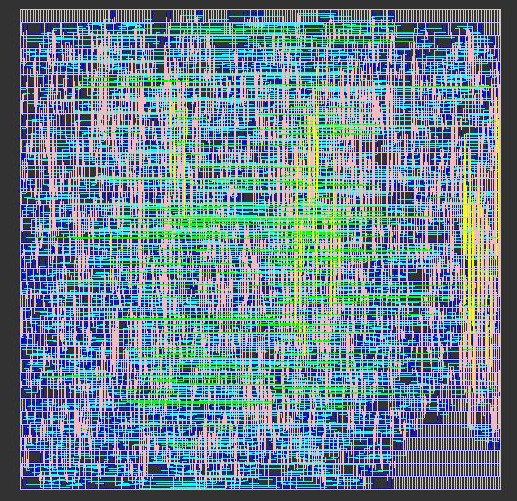
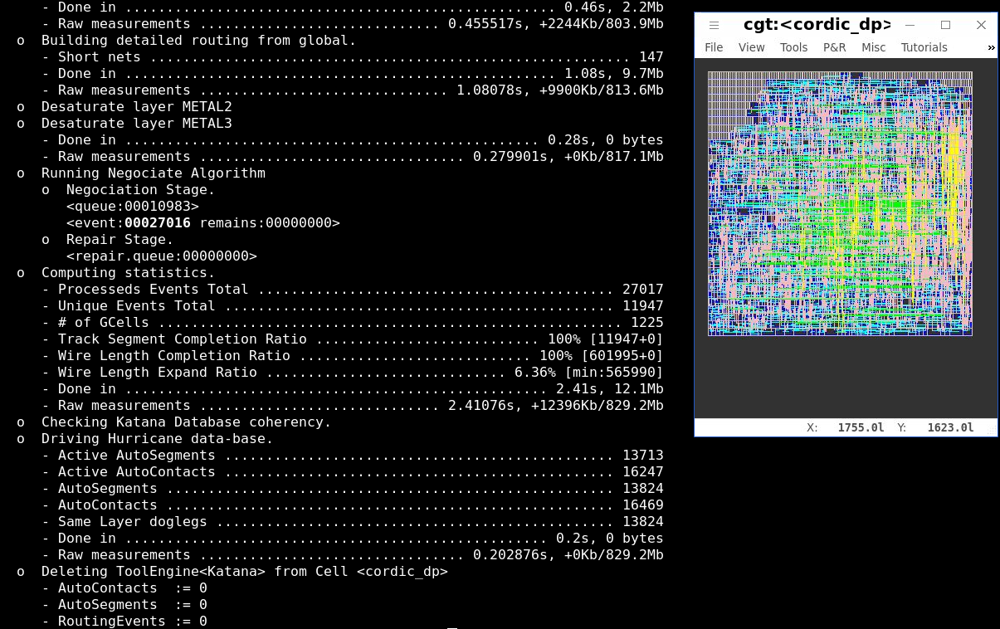
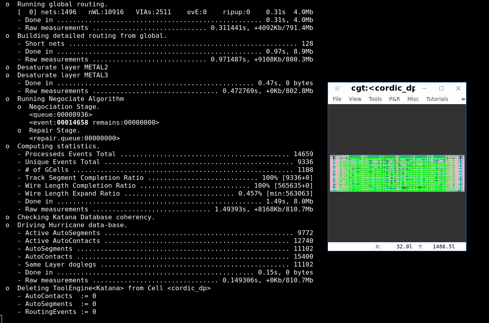
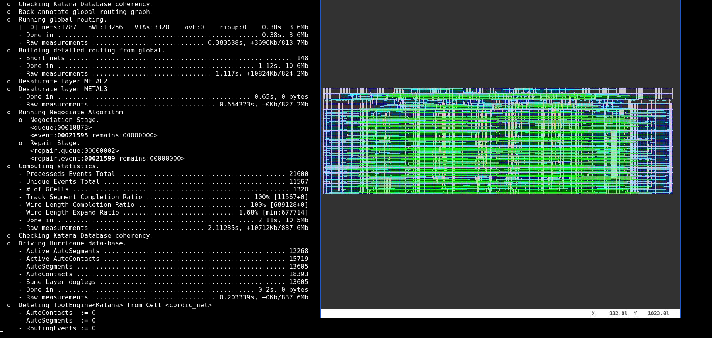

# Description comportemental,vérification,synthèse, placement&routage d'un coprocesseur "CORDIC"
(https://www-soc.lip6.fr/trac/sesi-tools/)

## I]TP3 : Description comportemental et vérification
### 1.Présentation de l'interface du CORDIC (core, la version split a ete modifie)

```vhdl
    ck          : IN  std_logic;		    -- clock
    raz         : IN  std_logic;                    -- remise a 0

    wr_axy_p    : IN  std_logic;                    -- get x y
    a_p         : IN  std_logic_vector(9 DOWNTO 0); -- normalisateur d'angle pour etre dans le 1er cadrant
    x_p         : IN  std_logic_vector(7 DOWNTO 0); -- valeur a convertir (<<7, 7 chiffres apres la virgule)
    y_p         : IN  std_logic_vector(7 DOWNTO 0); -- valeur a convertir (<<7, 7 chiffres apres la virgule

    wok_axy_p   : OUT std_logic;                    -- sortie issue de l'automate
    rd_nxy_p    : IN  std_logic;                    -- passage a l'etat get 

    nx_p        : OUT std_logic_vector(7 DOWNTO 0); -- sortie resultat
    ny_p        : OUT std_logic_vector(7 DOWNTO 0); -- sortie resultat
    rok_nxy_p   : OUT std_logic                     -- read ok pour les nouvelles valeurs
```                                                 

### 2.Comportement de la MAE

```vhdl
    n_get       <= (get  AND NOT wr_axy_p)	    -- recuperer des valeurs
                OR (put  AND rd_nxy_p)		    --
                ;				    --
    n_norm      <= (get  AND wr_axy_p)		    -- normaliser (<<7)
                OR (norm AND NOT quadrant_0)	    --
                ;				    --
    n_calc      <= (norm AND quadrant_0)	    -- rotation
                OR (calc AND NOT (i = 7))	    --
                ;				    --
    n_mkc       <= (calc AND (i = 7))		    -- produit du res par les cos des angles
                OR (mkc  AND NOT (i = 2))	    --
                ;				    --
    n_place     <= (mkc  AND (i = 2))		    -- placement des poiints dans le cadrant d'origine
                ;				    --
    n_put       <= (place)			    -- retourne les resultats et demande de nouvelles valeurs
                OR (put  AND NOT rd_nxy_p)	    --
                ;				    --
```

### 3.Verification avec genpat/asimut

#### Fonctionnement genpat
Genpat 
L'outil Genpat permet de generer un fichier pat (pattern description format) a
partir d'un fichier ecrit en C qui va assigner chaque signal pour chaque temps.
Un fichier pat est un fichier de simulation.
Un oublie d'un signal a un temps est fatale pour la simulation.  Le reset
permet l'initialisation de certains signaux, ils seront notes "u" (non determine)
si le reset n'est pas positionne au debut de la simulation.
C'est pour cela qu'il faut faire un AFFECT avec la valeur "0b*" sur les sorties
qui seront à l'état 'undefine' au moment du reset. En effet il n'est pas
possible d'utiliser AFFECT pour affecter '0bu' aux signaux.  "0b*" indique à
ASIMUT de ne pas considérer cette valeur pour la comparaison et donc de ne pas
déclencher REPPORT.

#### Fonctionnement asimut

Asimut est un generateur de fichier pat a partir d'un fichier C. L'ecriture
en langage C est plus simple.

**Remarque :** Le pat_result généré par ASIMUT ne comporte pas les temps dans
les labels, contrairement au pat généré par GENPAT.


### 4.Verification par un testBench (sous Vivado)

Nous avons utiliser Vivado car il permet l'execution de testbench pour la simulation contrairement à Asimut. En effet, l'utilisation de testPattern dans ce cas n'est pas des plus evidente. Car seul les resultats en entrées et en sortie au moment de l'activation des commandes WR et RD nous interesse. Tout signaux de sorties durant la phase de traitement n'ont pas leurs importances, car ils ne sont pas lue tant qu'il n'y a pas de demande de lecture.

Pour reformuler, lors de l'etablissement du testPattern, il est difficil et non nécessaire de decrire les valeurs à tester durant la phase de calcul. Nous ne voulons tester les valeurs que après que le signal read_ok soit vrai. Or il n'est pas possible au travers d'asimut de demander des test sous condition. Pour cela nous avons commencer par appliquer une période de latence sufisament longue avant que asimut ne test les sortie. Ce qui est prevut par l'outils.
Cependant, pour une raison que nous avons oublier, cela ne s'est pas reveler fructifiant. surement à cause d'un mauvais design.
Nous avons alors eût l'idée de simuler au travers d'un testBench, qui permet quand à lui de fournir des conditions utilisant le resultats de signaux du composant à tester.

Nous avons décrit deux design. Les deux ne sont pas fonctionel.
Nous avons alors entreprit d'utiliser le design du tp4 (cordic_cor.vhd) pour décrire un testbench en vhdl (sous Vivado) afin de simuler nos design. Cependant, après 340 us de simulation qui ne renvoie aucunnes erreurs, sont apparus les erreurs suivantes :

```
Error:  error matching value(s) on output at image iteration 201: nX value is -1 and must be 0 ; and nY value is 123 and must be 123;
Time: 323350 ns  Iteration: 1  Process: /cordic_tb/Stimulus_check  File: /home/sekouri/Documents/VivadoMOCCA/tp3/tempCORDIC/tempCORDIC.srcs/sim_1/new/cordic_tb.vhd
Error:  error matching value(s) on output at image iteration 202: nX value is -1 and must be 0 ; and nY value is 123 and must be 123;
Time: 325050 ns  Iteration: 1  Process: /cordic_tb/Stimulus_check  File: /home/sekouri/Documents/VivadoMOCCA/tp3/tempCORDIC/tempCORDIC.srcs/sim_1/new/cordic_tb.vhd
Error:  error matching value(s) on output at image iteration 203: nX value is -3 and must be -2 ; and nY value is 123 and must be 123;
Time: 326750 ns  Iteration: 1  Process: /cordic_tb/Stimulus_check  File: /home/sekouri/Documents/VivadoMOCCA/tp3/tempCORDIC/tempCORDIC.srcs/sim_1/new/cordic_tb.vhd
Error:  error matching value(s) on output at image iteration 204: nX value is -3 and must be -2 ; and nY value is 123 and must be 123;
Time: 328450 ns  Iteration: 1  Process: /cordic_tb/Stimulus_check  File: /home/sekouri/Documents/VivadoMOCCA/tp3/tempCORDIC/tempCORDIC.srcs/sim_1/new/cordic_tb.vhd
Error:  error matching value(s) on output at image iteration 205: nX value is -5 and must be -4 ; and nY value is 123 and must be 123;
Time: 330150 ns  Iteration: 1  Process: /cordic_tb/Stimulus_check  File: /home/sekouri/Documents/VivadoMOCCA/tp3/tempCORDIC/tempCORDIC.srcs/sim_1/new/cordic_tb.vhd
Error:  error matching value(s) on output at image iteration 206: nX value is -5 and must be -4 ; and nY value is 123 and must be 123;
Time: 331850 ns  Iteration: 1  Process: /cordic_tb/Stimulus_check  File: /home/sekouri/Documents/VivadoMOCCA/tp3/tempCORDIC/tempCORDIC.srcs/sim_1/new/cordic_tb.vhd
Error:  error matching value(s) on output at image iteration 207: nX value is -7 and must be -6 ; and nY value is 123 and must be 123;
Time: 333550 ns  Iteration: 1  Process: /cordic_tb/Stimulus_check  File: /home/sekouri/Documents/VivadoMOCCA/tp3/tempCORDIC/tempCORDIC.srcs/sim_1/new/cordic_tb.vhd
Error:  error matching value(s) on output at image iteration 208: nX value is -7 and must be -6 ; and nY value is 123 and must be 123;
Time: 335250 ns  Iteration: 1  Process: /cordic_tb/Stimulus_check  File: /home/sekouri/Documents/VivadoMOCCA/tp3/tempCORDIC/tempCORDIC.srcs/sim_1/new/cordic_tb.vhd
Error:  error matching value(s) on output at image iteration 209: nX value is -9 and must be -8 ; and nY value is 123 and must be 123;
Time: 336950 ns  Iteration: 1  Process: /cordic_tb/Stimulus_check  File: /home/sekouri/Documents/VivadoMOCCA/tp3/tempCORDIC/tempCORDIC.srcs/sim_1/new/cordic_tb.vhd
Error:  error matching value(s) on output at image iteration 210: nX value is -9 and must be -8 ; and nY value is 123 and must be 123;
Time: 338650 ns  Iteration: 1  Process: /cordic_tb/Stimulus_check  File: /home/sekouri/Documents/VivadoMOCCA/tp3/tempCORDIC/tempCORDIC.srcs/sim_1/new/cordic_tb.vhd
Error:  error matching value(s) on output at image iteration 211: nX value is -11 and must be -10 ; and nY value is 123 and must be 123;
Time: 340350 ns  Iteration: 1  Process: /cordic_tb/Stimulus_check  File: /home/sekouri/Documents/VivadoMOCCA/tp3/tempCORDIC/tempCORDIC.srcs/sim_1/new/cordic_tb.vhd
run 100 us
Error:  error matching value(s) on output at image iteration 212: nX value is -11 and must be -10 ; and nY value is 123 and must be 123;
Time: 342050 ns  Iteration: 1  Process: /cordic_tb/Stimulus_check  File: /home/sekouri/Documents/VivadoMOCCA/tp3/tempCORDIC/tempCORDIC.srcs/sim_1/new/cordic_tb.vhd
Error:  error matching value(s) on output at image iteration 213: nX value is -13 and must be -12 ; and nY value is 123 and must be 123;
Time: 343750 ns  Iteration: 1  Process: /cordic_tb/Stimulus_check  File: /home/sekouri/Documents/VivadoMOCCA/tp3/tempCORDIC/tempCORDIC.srcs/sim_1/new/cordic_tb.vhd
Error:  error matching value(s) on output at image iteration 214: nX value is -13 and must be -12 ; and nY value is 123 and must be 123;
Time: 345450 ns  Iteration: 1  Process: /cordic_tb/Stimulus_check  File: /home/sekouri/Documents/VivadoMOCCA/tp3/tempCORDIC/tempCORDIC.srcs/sim_1/new/cordic_tb.vhd
Error:  error matching value(s) on output at image iteration 215: nX value is -15 and must be -14 ; and nY value is 122 and must be 122;
Time: 347150 ns  Iteration: 1  Process: /cordic_tb/Stimulus_check  File: /home/sekouri/Documents/VivadoMOCCA/tp3/tempCORDIC/tempCORDIC.srcs/sim_1/new/cordic_tb.vhd
```

Il s'agit là des premières erreurs qui sont apparus, les assert ne cessant de se declencher à ce point.

Pensant recuperer un testBench juste, et ce dans le but de debuguer nos design; nous avons due repousser cette étape. Jusque là nos design ne sont donc pas fonctionel. De plus nous ne sommes apte à dire si il y a une erreur dans le testBench ou bien dans le design cordic_cor.

## II]TP4 : Synthèse et placement&routage dans la chaine Coriolis2

https://www-soc.lip6.fr/trac/sesi-tools/

https://www-soc.lip6.fr/master-sesi/ue-mocca/tme-4/

### Introduction

Dans ce TP, nous réalisons la suite "logique" du design du cordic_core, c'est à dire sa synthèse et son P&R (Placement & Routage).

Pour cela, nous avons pris le design du CORDIC fournis par le professeur car nous n'avions pas finis de tester le notre et de plus cela évite des erreurs induit par un mauvais design alors que le but du TP concerne la synthèse et le P&R et non plus de design d'une architecture.

Nous sommes donc partis des fichiers "cordic_core.vhd" et du couple de fichiers dit "split" que sont "cordic_ctl.vhd" et "cordic_dp.vhd".

Nous avons donc deux approches de synthèse/P&R :

    -- i) synthèse directe de "cordic_core" en mode "press-button". "cordic_core.vhd" est le design complet.
  
    -- ii) synthèse en 2 parties avant P&R; d'où le terme de "split_cordic" en une partie contrôle "cordic_ctl" et une partie DataPath "cordic_dp" (chemin de données ou partie opérative).
 
 Dans le cas (ii) l'avantage est de pouvoir "aider"(aider au sens du résultat) l'outil de P&R en allant faire à la main du "macro-placement" et ainsi obtenir de meilleures résultats que dans la solution (i) qui se résume à du press-button.


### YOSYS : Outil de synthèse

  source_valid(.vhdl) --**Vasy**--> source_valid(.v) --**Yosys**--> source_synth(.blif) 
  
  source(.ap/.vst/.vbe)--Stratus_net.py--> result(?)
  source(?)--CGT-->source_placed(?)

#### Press-button du cordic_core

Dans le dossier cordic_core : 
Il faut :
    - make  pour generer le fichier verilog.
    - lancer le script (potentiellement a la main car il faut que le eval ne soit pas lancer dans un autre shell)
    - suivre les instructions de "instruction_yosys.md"
    - suivre les instructions de "instruction_cgt.md" (ne pas oublier de import cell dans cgt)

le resultat final est :




### Interface Netlist Layout

#### Netlist

Le coeur du travail a été de traduire à la main le "cordic_dp.vhd" en "cordic_dp.py", qui est un script python faisant appel à la bibliothèque python du nom de STRATUS (fourni par CORIOLIS). Ce script décrit la netlist du DP.

Pour y parvenir nous avons dans un premier temps tenter une description "bourain". Mais cela nous mettait des battons dans les roues. Nous avons donc repris à zéro en commencant par décrire explicitement (en détail) le DP grâce à l'outil DrawIO. Ainsi tout les noms des NETS et des instances de la partie DP deviennent plus lisible comme vous pouvez le constater ci-dessous :

<!

>
[](DP.png)

Donc, nous reprenons les mêmes noms d'instances et de nets dans le script python.
De plus, nous nous sommes rendus compte qu'il est préférable de déclarer au plus tard les signaux. Soit dès qu'il y en a besoin juste avant la declaration d'une instance ayant besoin de ses entrées, afin de rendre le code plus lisible.

#### Interface

Nous avons eût aussi des problème pour l'interface. En effet les signaux de contrôles proposer n'étaient pas parfait et nécéssiter aussi des opérations logiques avant de pouvoir controler certains multiplexeur. De plus nous avons modifier, ou plutôt alléger les arbres de multiplexeurs que sont ceux des signaux "nx" et "ny". Et donc, nous devions adapter les commandes. 

##### Exemple : Génération du signal nx

Les commandes fournit par la partie contrôle et utilisé dans la partie données, n'étaient pas adapté !
En effet il était nécéssaire de combiner plusieurs signaux de controle pour les multiplexeurs et additionneurs. Nous avons donc modifié la partie contrôle afin qu'elle s'adapte à la partie données. 

Nous avons commencer par décrire l'arbre de multiplexeur que voici : 

<!

>
[](nx_mux_stages.png)

A la suite de cela, nous décrivons le tableau suivant :

| X side          | CMD_n_0 | CMD_n_1_1 | CMD_n_1_0 | CMD_n |
|-----------------|---------|-----------|-----------|-------|
| x               |         |           |           |       |
| x(7)&x&000 0000 |         |           |           |       |
| + xkc           |         |           |           |       |
| - xkc           |         |           |           |       |
| + ykc           |         |           |           |       |
| - ykc           |         |           |           |       |
| + x + y_sra_i   |         |           |           |       |
| + x - y_sra_i   |         |           |           |       |

Ainsi pour chaque ligne nous deffinisons le chemin à travers l'arbre de multiplexeur pour la recopie de l'entrée voulue sur la sortie final.
Nous éclatons les "plus ou moins". Nous ajoutons une colonne identique pour la partie de données sur Y.
Nous remplisons les valeurs que doivent prendre les commandes des multiplexeur. Enfin nous obtenons le tableau suivant :

| Y side          | X side          | CMD_n_0 | CMD_n_1_1 | CMD_n_1_0 | CMD_n | conditions dans la partie contrôle       |
|-----------------|-----------------|---------|-----------|-----------|-------|------------------------------------------|
| y               | x               | 0       | -         | 1         | 0     | put = 1                                  |
| y(7)&y&000 0000 | x(7)&x&000 0000 | 1       | -         | 1         | 0     | init = 1                                 |
| + ykc           | + xkc           | -       | 0         | -         | 1     | place_p = 1 AND Q_p = 0                  |
| - ykc           | - xkc           | -       | 0         | -         | 1     | place_p = 1 AND Q_p = 2                  |
| - xkc           | + ykc           | -       | 1         | -         | 1     | place_p = 1 AND Q_p = 3                  |
| + xkc           | - ykc           | -       | 1         | -         | 1     | place_p = 1 AND Q_p = 1                  |
| + y - x_sra_i   | + x + y_sra_i   | -       | -         | 0         | 0     | calc_p = 1 AND a_lt_0_p = 1              |
| + y + x_sra_i   | + x - y_sra_i   | -       | -         | 0         | 0     | calc = 1 AND calc_p = 1 AND a_lt_0_p = 0 |

Puis nous y ajoutons la dernière colonne (dont le résultat apparait déjà), afin de determiner le combinatoire des commandes qui devront apparaitre dans la description VHDL de la partie controle.

Voivi les commandes extraites du vhdl du cordic_ctl:

CMD_n_0   = init;
CMD_n_1_1 = place_p AND quadrant_p(0) 
CMD_n_1_0 = put OR init;
CMD_n     = place_p;

Nous avons soigneusement choisis, intrinsequement à chaque multiplexeur, les entrées i0 et i1 afin de simplifier les commandes.
De plus, puisque la MAE ne peut être que dans un seul état et que les commandes peuvent prendre dans certains cas des valeurs quelconque (indiquées par "-"), il nous a été possible d'obtenir un combinatire très simplifier. Mais aussi en analysant les bits du vecteur Q_p nous avons pu simplifier l'expression de la commande CMD_n_1_1 !

Il est à noter que nous avons pû optimiser le nombre d'entrées qui passe se 8 à 5. Cela en reportant une partie de la commande de cet arbre de multiplexeur sur les additioneurs permettant d'obtenir les valeurs inverses de xkc,ykx et x/y +- y/x_sra_i.

Il est aussi à noter que ces commandes sont réutilisable dans le chemin de données Y  ormis pour un unique multiplexeur !


#### Layout

Nous avons immédiatement tenter de faire un macro-placement optimisé. Mais celui-ci était naïf. En effet le résultat obtenue fut catastrophique et nous nous en sommes rendus compte après avoir fait le placement proposer dans le sujet que l'on nomera "placement place-right".

Nous sommes partis d'un principe totalement arbitraire mais simple qui est que "toutes les instances consomment la même surface". Ce qui donne le brouillon suivant :

-----------------inclure la fameuse photos !

Nous avons alors encore tenter de rélaiser des macro-placement plus optimiser que le "place-right" mais sans y parvenir. Nous avons donc conclus qu'il est nécéssaire d'avoir une certaine expertise/maitrise sur l'outil STRATUS pour obtenir un résultat optimisé. Et donc par manque de temps nous nous sommes contenter du placement "place-right" pour le P&R "reunuion" de la partie contrôle et DataPath.

A noter que dans le script python, les shifts sur les signaux x et y en entrées des arbres de multiplexeurs "sra_i" ne sont pas des shifts en série comme représenté sur le schéma mais des shifts en parallèles. Cela peut induire un grand fanout sur les signaux x et y mais si le fanout reste correct alors cela permet potentiellement un gain de "performance".

### Cordic_net

Il nous faut donc deux interface cohérante entres elles et adapter le script python cordic_net.py. Ensuite nous pouvons le lancer et obtenir un resultat que nous pouvons comparer à celui générer par le "press-button" du "cordic_core.vhd".

#### etapes :
    - makefile pour avoir un verilog
    - synthese avec yosys et le sript yosys
    - placement a la main avec le script python (au choix, vous pouvez lire nos script ici, on va representer un placeRight)
    - routage avec CGT (katana)
	- open cell cordic_dp et placement.

#### Place avec CGT


#### Place a la main


#### etapes pour dp + ctl:
    - makefile pour avoir deux verilog
    - synthese avec yosys et le sript yosys ctl
    - synthese et placement a la main avec stratus
    - net global avec le script cordic_net
    - routage avec CGT (katana)




<! /users/outil/tasyag/Linux.el7_64/install/share >
